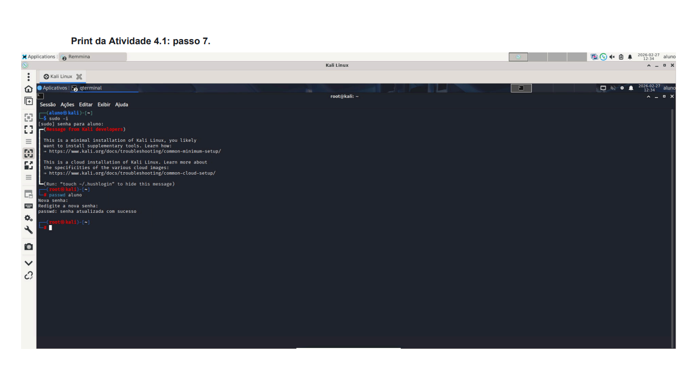
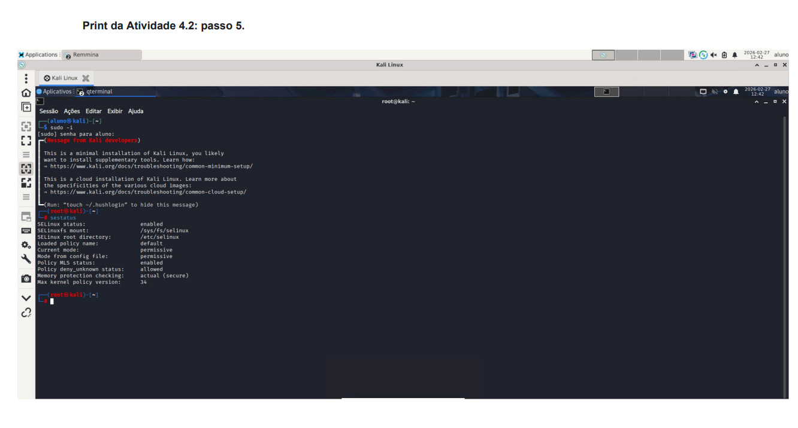
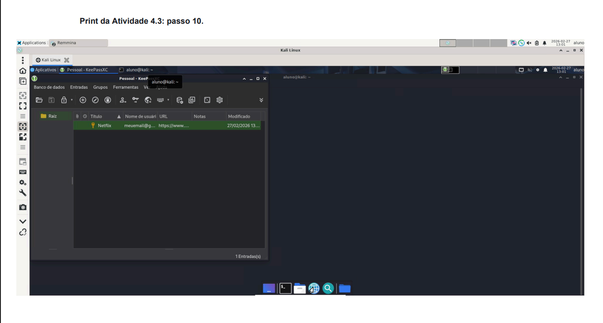
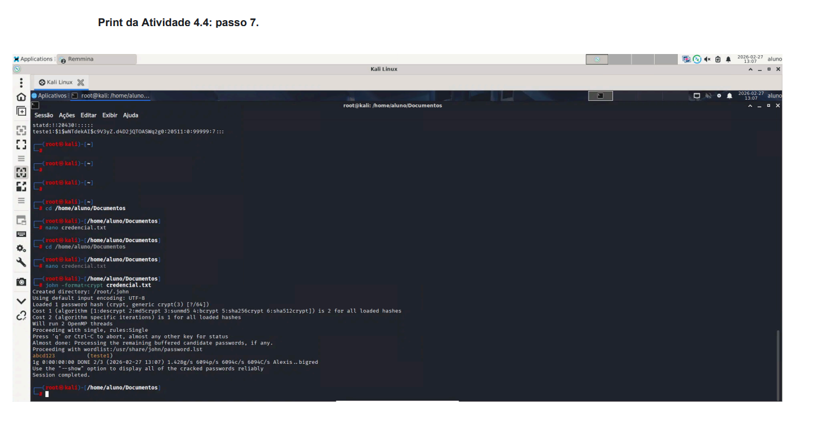
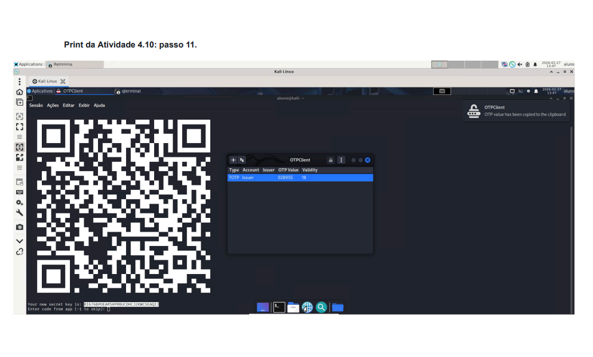

# **Controle de Autenticação e Gestão de Credenciais**

Este repositório documenta a execução de atividades laboratoriais focadas na gestão de identidades, implementação de Controle de Acesso Obrigatório (MAC) e auditoria de integridade de credenciais.

## **📊 Gestão do Projeto**

| Projeto | Objetivo | Status |
| :---- | :---- | :---- |
| **Gestão de Identidade** | Modificar parâmetros de utilizador e senhas no Linux. | ✅ Concluído |
| **Endurecimento (SELinux)** | Ativar o Security-Enhanced Linux para controle de acesso. | ✅ Concluído |
| **Cofre de Senhas** | Gerir credenciais com criptografia AES-256 no KeePassXC. | ✅ Concluído |
| **Auditoria de Senhas** | Realizar quebra de hashes offline com John the Ripper. | ✅ Concluído |
| **MFA e Windows** | Configurar Gerenciador de Credenciais e 2FA (OTP). | ✅ Concluído |

## **🏗️ 1\. Identidade e Autenticação no Linux**

O objetivo desta etapa foi explorar como o Linux armazena e protege as informações de utilizadores.

### **1.1 Exploração do Sistema**

* **Comandos de Verificação:** whoami (utilizador atual) e pwd (localização).  
* **Análise de Arquivos Críticos:**  
  * /etc/passwd: Verificação de UID, GID e Shell padrão.  
  * /etc/shadow: Local onde os hashes das senhas são armazenados com permissão restrita.

### **1.2 Modificação de Parâmetros de Autenticação**

Para garantir a conformidade com as políticas de segurança, procedeu-se à alteração da senha:

Bash

\# Elevação para superutilizador  
sudo \-i  
\# Alteração da senha do utilizador aluno  
passwd aluno  
\# Inserção da nova senha conforme política estabelecida

## **🛡️ 2\. Controles Técnicos e Hardening (MAC)**

### **2.1 Security-Enhanced Linux (SELinux)**

Implementação de uma camada adicional de segurança que define permissões de controle de acesso para aplicações, processos e ficheiros.

* **Ativação:** Execução do comando selinux-activate e reinicialização para carregamento do kernel.  
* **Monitoramento:** \* sestatus: Verificação do modo operacional (Permissive).  
  * semanage login \-l: Mapeamento de utilizadores do sistema para utilizadores SELinux.

## **🔐 3\. Gestão de Credenciais e Auditoria**

### **3.1 Cofre de Senhas (KeePassXC)**

Criação de um banco de dados seguro para mitigar o uso de senhas fracas ou repetidas.

* **Criptografia:** Algoritmo AES 256-bit.  
* **Ação:** Criação do arquivo Senhas.kdbx e armazenamento de credenciais de serviços externos.

### **3.2 Auditoria com John the Ripper**

Simulação de um ataque de força bruta/dicionário para validar a robustez das senhas.

Bash

\# Criação de um utilizador de teste com senha fraca  
useradd teste1  
\# Execução da quebra de senha via John the Ripper  
john \--format=crypt credencial.txt

* **Resultado:** A ferramenta identificou a senha abcd123 com sucesso, demonstrando a vulnerabilidade de senhas simples.

### **3.3 Gestão de Acessos no Windows e MFA**

* **Windows Credential Manager:** Limpeza e organização de credenciais salvas no Windows Server 2022\.  
* **Multi-Factor Authentication (MFA):** Configuração de segredos e tokens TOTP utilizando o **OTPClient**.

## **⚙️ Tecnologias & Ferramentas**

* **Sistemas:** Kali Linux, Windows Server 2022\.  
* **Segurança:** SELinux, John the Ripper, KeePassXC.  
* **Autenticação:** OTPClient (TOTP), Passwd, Credential Manager.

*Este projeto foi realizado para fins educacionais e demonstra competências em gestão de acessos e identidade.*
