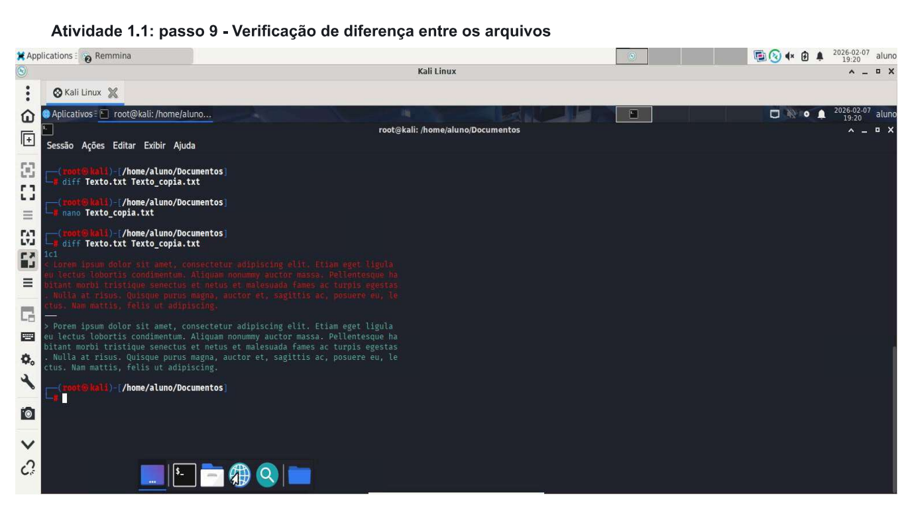
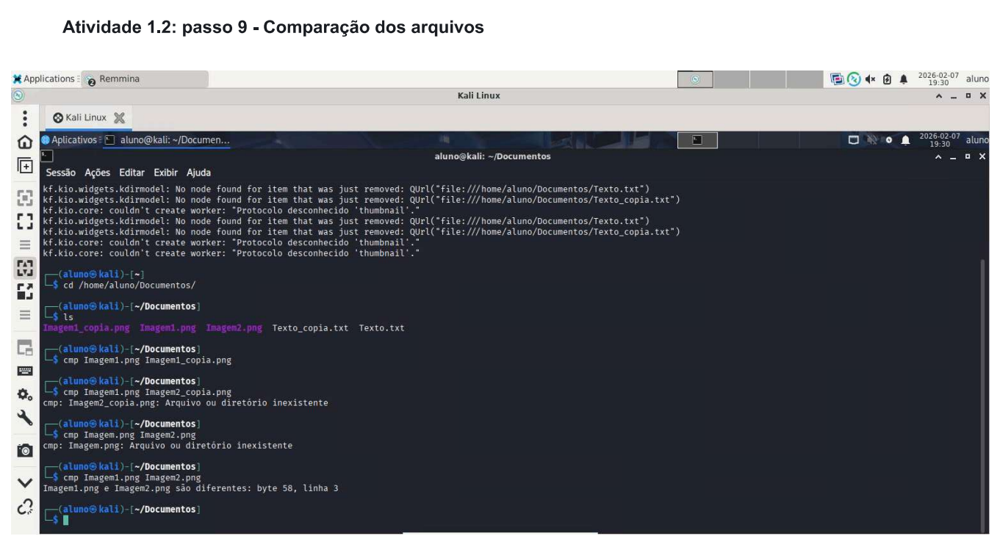
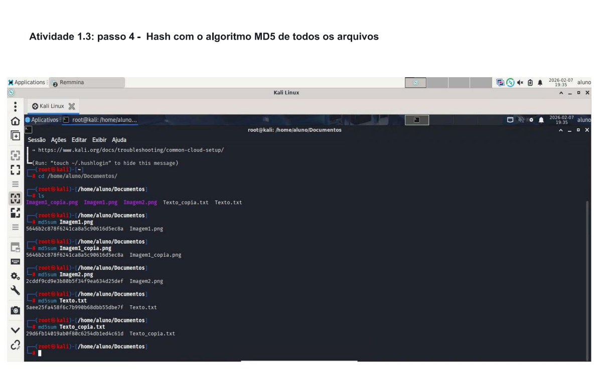
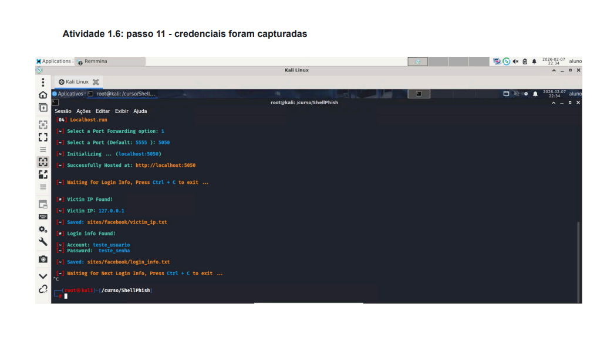
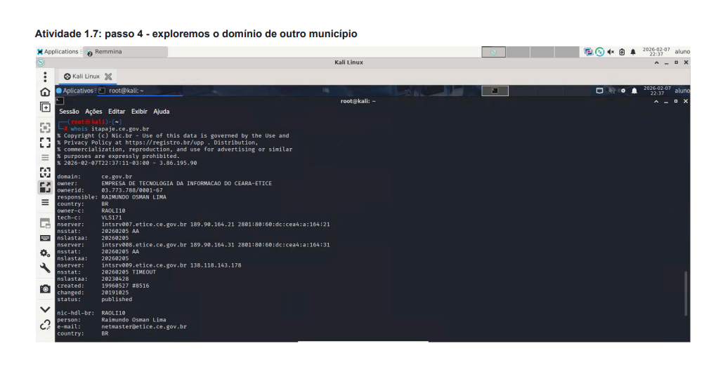
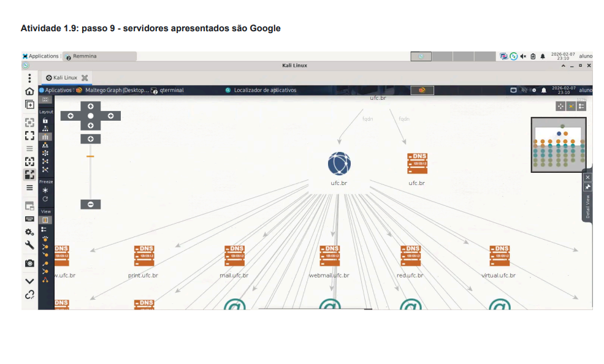
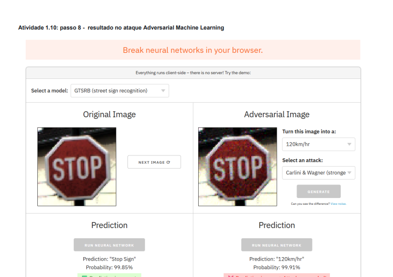

Fundamentos de Defesa e Ataque (Kali Linux)

Este repositório documenta a execução prática de laboratórios de cibersegurança, cobrindo os pilares da **Integridade**, **Confidencialidade** e fases de **Reconhecimento (OSINT)**.

## 📊 Gestão do Projeto

| Projeto | Objetivo | Status |
| --- | --- | --- |
| **Integridade de Dados** | Validar manipulações de ficheiros via Diff, Cmp e MD5. | ✅ Concluído |
| **Criptografia Clássica** | Implementar Cifra de César em Python e estudar ROT13. | ✅ Concluído |
| **Engenharia Social** | Simular Phishing para análise de captura de credenciais. | ✅ Concluído |
| **OSINT & Recon** | Mapear infraestrutura e domínios com WHOIS e Maltego. | ✅ Concluído |
| **Adversarial ML** | Estudar a manipulação de modelos de IA através de ruído. | ✅ Concluído |
| **Fluxo de Trabalho** | Gestão de tarefas de segurança via terminal (Taskwarrior). | ✅ Concluído |

---

## 🏗️ 1. Verificação de Integridade e Forense

A integridade assegura que a informação não foi alterada. Testamos esta premissa em três níveis:

### 1.1 Comparação de Texto (`diff`)

* **Ação:** Comparação entre `Texto.txt` e uma cópia manipulada.
* **Resultado:** O comando identificou a alteração exata na linha 1, demonstrando como auditorias detetam intrusões.



### 1.2 Comparação Binária (`cmp`)

* **Ação:** Verificação byte-a-byte de duas imagens aparentemente iguais.
* **Resultado:** Identificada divergência no **byte 58**, provando que edições impercetíveis alteram a estrutura binária.



### 1.3 Assinaturas Digitais (MD5)

* **Ação:** Geração de hash para validar autenticidade.
* **Resultado:** Qualquer alteração mínima gerou um hash totalmente diferente (Efeito Avalanche).


---

## 🔐 2. Criptografia e Confidencialidade

### 2.1 Cifra de César (Implementação Python)

```py
Desenvolvi um script para automatizar a cifragem de mensagens através de deslocamento de caracteres.

def caesar_cipher(text, shift):
    result = ""
    for char in text:
        if char.isalpha():
            shift_amount = shift % 26
            if char.islower():
                shifted = ord(char) + shift_amount
                if shifted > ord("z"):
                    shifted -= 26
                result += chr(shifted)
            else:
                shifted = ord(char) + shift_amount
                if shifted > ord("Z"):
                    shifted -= 26
                result += chr(shifted)
        else:
            result += char
    return result

def main():
    text = input("Digite o texto a ser cifrado/descifrado: ")
    shift = int(input("Digite a quantidade de posições a ser deslocada: "))
    encrypted_text = caesar_cipher(text, shift)
    print("Texto cifrado/descifrado:", encrypted_text)

if __name__ == "__main__":
    main()
```
---

## 🎣 3. Engenharia Social e Phishing Simulado

Estudo do vetor de ataque de captura de credenciais.

* **Ferramenta:** `ShellPhish`.
* **Cenário:** Criação de uma página falsa do Facebook em `localhost:5050`.
* **Resultado:** Interceção bem-sucedida de endereços IP e credenciais (`username/password`) em texto claro nos logs do sistema.


---

## 🔍 4. Inteligência e Reconhecimento (OSINT)

### 4.1 Análise de Domínio (WHOIS)

* **Execução:** `whois es.rnp.br` e `whois itapaje.ce.gov.br`.
* **Descoberta:** Identificação de servidores DNS (Cloudflare/RNP), contactos técnicos e datas de expiração de domínios institucionais.




### 4.2 Mapeamento de Infraestrutura (Maltego)

* **Ação:** Mapeamento do domínio `ufc.br`.
* **Resultados:** Identificação de servidores de nomes, subdomínios e extração de entidades (pessoas) vinculadas via chaves PGP.


---

## 🤖 5. Adversarial Machine Learning

* **Conceito:** Exploração de vulnerabilidades em modelos de IA.
* **Prática:** Utilização do `adversarial.js` para demonstrar como a inserção de ruído impercetível numa imagem força uma IA a classificar um objeto incorretamente.


---

## 🛠️ Tecnologias & Ferramentas

* **OS:** Kali Linux
* **Linguagens:** Python 3, Bash
* **Tools:** `md5sum`, `diff`, `cmp`, `whois`, `ShellPhish`, `Maltego`, `Taskwarrior`


*Este projeto foi realizado para fins educacionais e demonstra competências em ferramentas de segurança no ecossistema Linux.