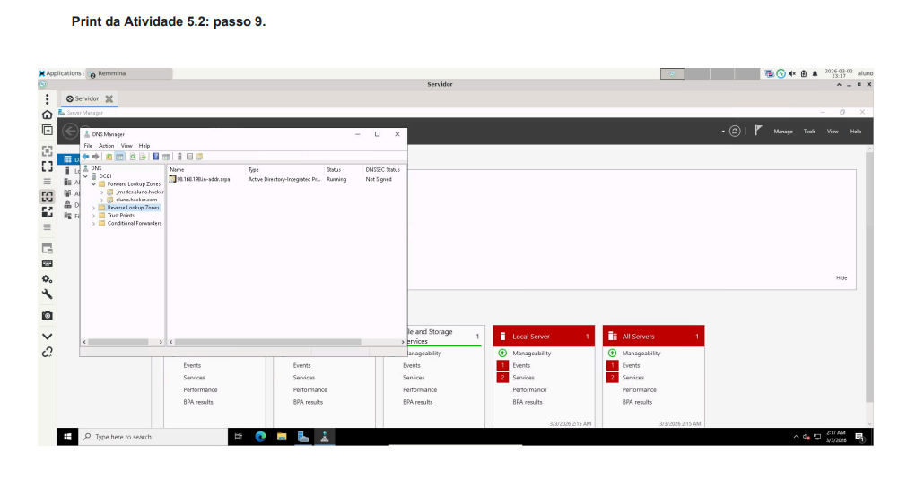
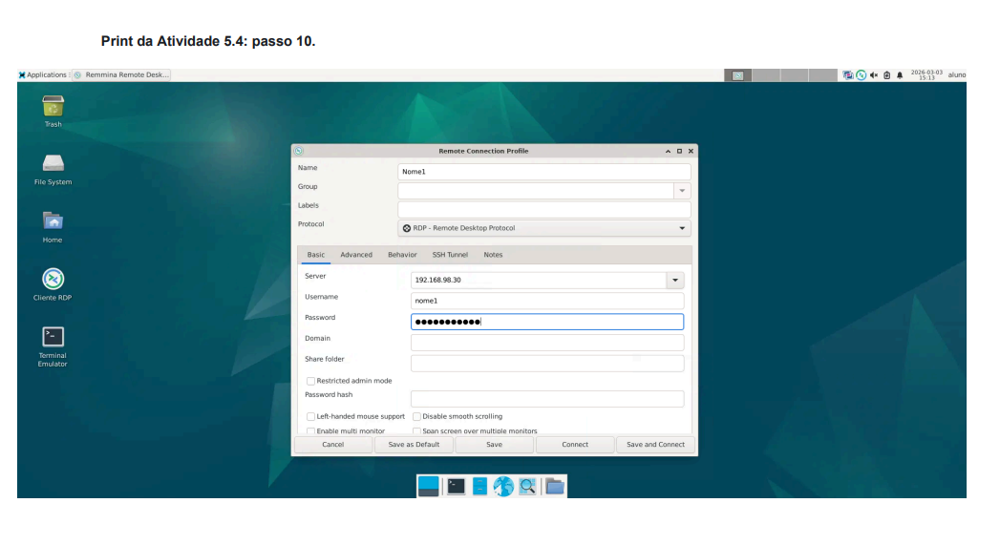
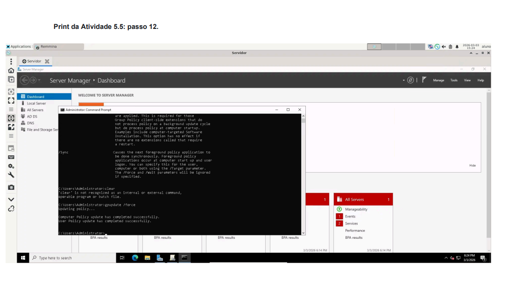
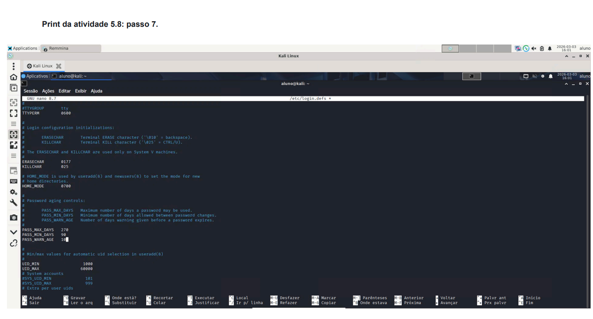
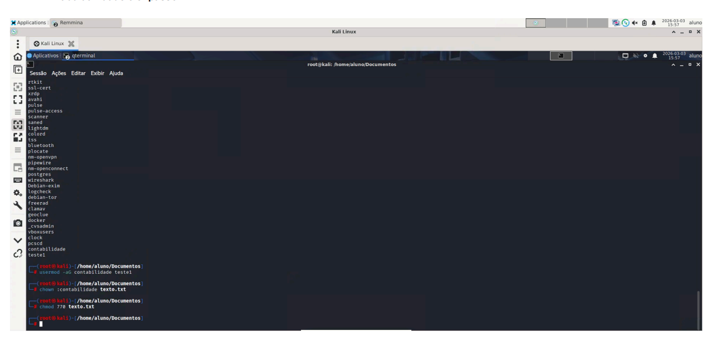

# **Infraestrutura de Redes e Governança de Segurança (AD & Linux)**

Este repositório contém a documentação técnica e os procedimentos práticos realizados para a implementação de uma infraestrutura de rede corporativa segura. O projeto foca na centralização de identidade via **Active Directory**, endurecimento de políticas de senhas (**Hardening**) e gestão de acessos (**DAC/RBAC**) em sistemas Windows Server 2022 e Kali Linux.

## **📊 Resumo do Projeto**

| Atividade | Descrição Técnica | Status |
| :---- | :---- | :---- |
| **Active Directory DS** | Promoção de DC, configuração de Floresta e DNS Reverso. | ✅ |
| **GPO & Hardening** | Implementação de políticas de senha (complexidade e expiração). | ✅ |
| **Controle de Acesso (DAC)** | Gestão discricionária de permissões de arquivos no Windows e Linux. | ✅ |
| **Gestão por Função (RBAC)** | Implementação de acesso baseado em grupos funcionais no Kali Linux. | ✅ |
| **Rotação de Senhas** | Configuração de ciclo de vida de credenciais no Linux (login.defs). | ✅ |

---

## **🏗️ 1\. Infraestrutura Active Directory (Windows Server 2022\)**

O objetivo foi estabelecer um serviço de diretório centralizado para gerir a autenticação da rede aluno.hacker.com.

### **1.1 Configuração do Domain Controller (DC01)**

* **Promoção do Servidor:** Instalação das roles AD DS e DNS, promovendo o servidor DC01 (IP 192.168.98.20) como raiz da nova floresta.  
* **Configuração de DNS:** Implementação de **Zonas de Pesquisa Inversa** (Network ID 192.168.98) e atualização de ponteiros (PTR) para garantir a integridade da resolução de nomes na sub-rede.

### **1.2 Gestão de Usuários e Acesso Remoto**

* **Criação de Identidades:** Estruturação de Unidades Organizacionais (OU) como "Rede1" e "TI".  
* **Acesso via RDP:** Configuração da GPO "Alunos" para permitir que usuários do domínio realizem logon via Remote Desktop Services, validada com o comando gpupdate /force.

## **🛡️ 2\. Hardening e Políticas de Segurança**

### **2.1 Políticas de Grupo (GPO) \- Windows**

Implementação de uma política de senhas robusta para mitigar ataques de força bruta:

* **Comprimento Mínimo:** 9 caracteres.  
* **Idade Máxima:** Expiração automática em 120 dias.  
* **Histórico de Senhas:** Armazenamento das últimas 3 senhas para evitar reuso.  
* **Complexidade:** Ativação obrigatória de requisitos de complexidade.

### **2.2 Ciclo de Vida de Credenciais \- Linux**

Configuração do arquivo /etc/login.defs no Kali Linux para garantir a rotação de senhas:

* PASS\_MAX\_DAYS 270: Validade máxima da senha.  
* PASS\_MIN\_DAYS 90: Tempo mínimo de permanência com a mesma senha.  
* PASS\_WARN\_AGE 10: Aviso de expiração com 10 dias de antecedência.

## **🔐 3\. Modelos de Controle de Acesso**

### **3.1 Controle de Acesso Discricionário (DAC)**

* **Windows:** Uso do sistema de ficheiros NTFS para restringir permissões de leitura/escrita em pastas de usuários específicos.  
* **Linux:** Utilização do comando chmod u+rwx para atribuir permissões totais ao proprietário de ficheiros sensíveis (ex: texto.txt).

### **3.2 Controle de Acesso Baseado em Função (RBAC)**

Implementação de privilégios baseados no cargo/função do usuário no Linux:

1. **Criação de Grupo:** groupadd contabilidade.  
2. **Associação:** Atribuição do usuário ao grupo via usermod \-aG.  
3. **Permissão Granular:** Execução de chmod 770, garantindo acesso total ao proprietário e ao grupo funcional, enquanto bloqueia o acesso de qualquer outro usuário (permissão 0).

## **🛠️ Tecnologias Utilizadas**

* **Sistemas:** Windows Server 2022 e Kali Linux.  
* **Serviços:** AD DS, DNS Server, GPO Management.  
* **Comandos Chave:** gpupdate /force, chmod, chown, passwd \-S, getent.

---

*Projeto realizado para fins educacionais, focando na proteção de infraestruturas críticas e gestão de identidades.*
