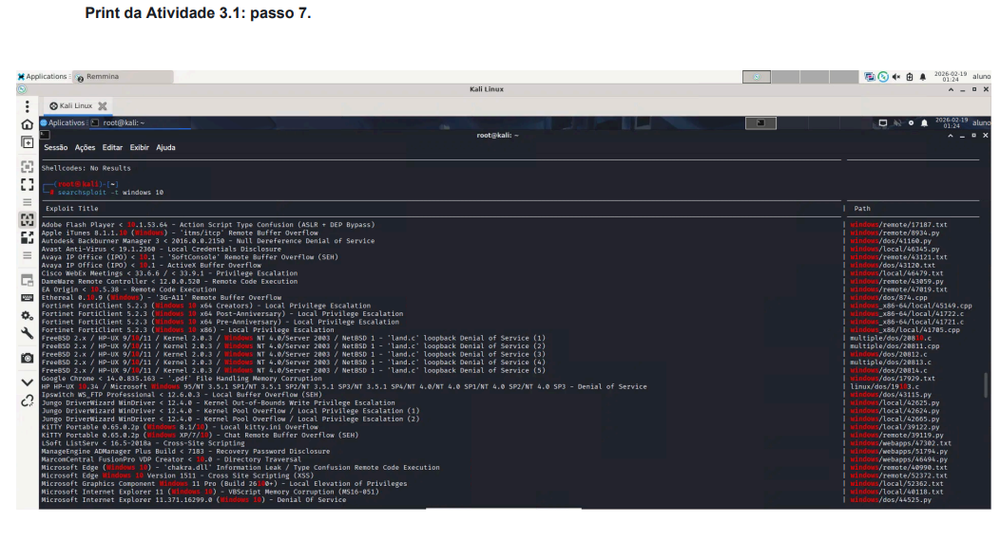
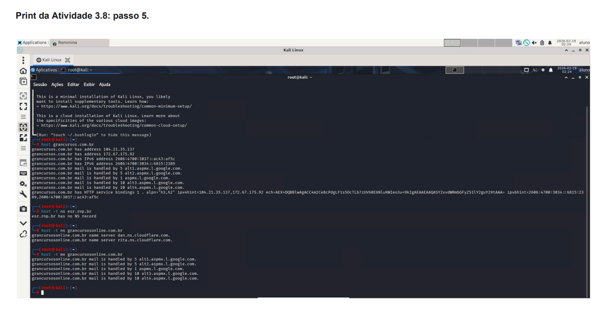
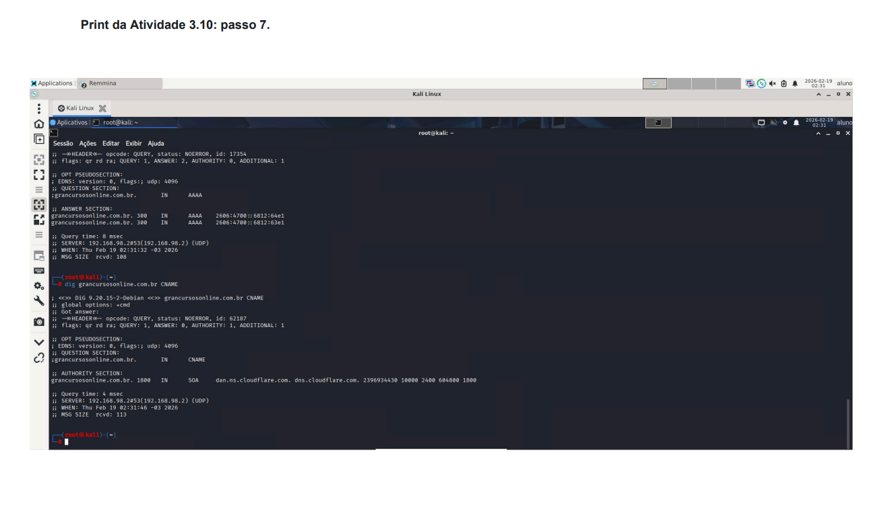

 Exploração de Vulnerabilidades e Reconhecimento DNS

Este repositório documenta a execução de atividades práticas voltadas para a busca de exploits conhecidos e técnicas de reconhecimento de infraestrutura via DNS, utilizando ferramentas nativas do Kali Linux.

## 📊 Gestão do Projeto

| Projeto | Objetivo | Status |
| --- | --- | --- |
| **Busca de Exploits** | Localizar vulnerabilidades conhecidas via Exploit Database (searchsploit). | ✅ Concluído |
| **Reconhecimento DNS (Dig)** | Consultar registos A, MX e CNAME de domínios específicos. | ✅ Concluído |
| **Transferência de Zona** | Simular a tentativa de transferência de zona DNS. | ✅ Concluído |
| **Enumeração de Subdomínios** | Identificar endereços através de ataques de força bruta com `dnsrecon`. | ✅ Concluído |

---

## 🏗️ 1. Exploração: Busca de Vulnerabilidades (Exploit-DB)

O objetivo foi explorar a base de dados local do Kali Linux para identificar falhas em softwares específicos.

### 1.1 Vetor de Pesquisa: Searchsploit

* **Ferramenta:** Exploit Database (`searchsploit`).
* **Procedimento:**

1. Tornar-se superusuário: `sudo -i`.
2. Listar diretórios do exploitdb:
```bash
ls -al /usr/share/exploitdb

```

3. Realizar buscas por termos específicos:
```bash
searchsploit afp
searchsploit "Linux Kernel"

```

* **Conceito:** A ferramenta permite filtrar exploits por plataforma (Windows, Linux, etc.) e tipo (Remote, Local, Webapps).

---



## 🔍 2. Reconhecimento de Infraestrutura (DNS)

Atividades focadas em obter informações públicas de servidores de nomes para mapeamento de superfície de ataque.

### 2.1 Consultas com DIG (Domain Information Groper)

Utilizado para interrogar servidores DNS e obter registos específicos.

* **Registo A (Endereço IP):**

```bash
dig grancursosonline.com.br A

```

* **Registo MX (Servidores de Email):**

```bash
dig grancursosonline.com.br MX

```

* **Registo CNAME (Nomes Canónicos):**

```bash
dig grancursosonline.com.br CNAME

```

### 2.2 Tentativa de Transferência de Zona (AXFR)

Simulação de uma técnica para obter a listagem completa de um ficheiro de zona DNS.

```bash
dig @8.8.8.8 grancursosonline.com.br axfr

```

---

## 🛡️ 3. Enumeração Ativa: DNSRecon

Uso de ataques de dicionário (Brute Force) para descobrir subdomínios que não estão listados publicamente.

* **Ferramenta:** `dnsrecon`.
* **Procedimento:**

1. Utilização de uma wordlist para testar prefixos comuns:

```bash
dnsrecon -d grancursosonline.com.br -D /usr/share/wordlists/dnsrecon/namelist.txt -t brt

```


* **Parâmetros:**
* `-d`: Domínio alvo.
* `-D`: Caminho da wordlist.
* `-t brt`: Tipo de enumeração (Brute Force).



---

## ⚙️ Tecnologias & Ferramentas

* **Sistema Operacional:** Kali Linux (IP: `192.168.98.xx').
* **Ferramentas de Reconhecimento:** `dig` (v9.18), `dnsrecon`.
* **Base de Dados:** `searchsploit` (Exploit-DB).

---


*Este projeto foi realizado para fins educacionais e demonstra competências em ferramentas de segurança no ecossistema Linux.
